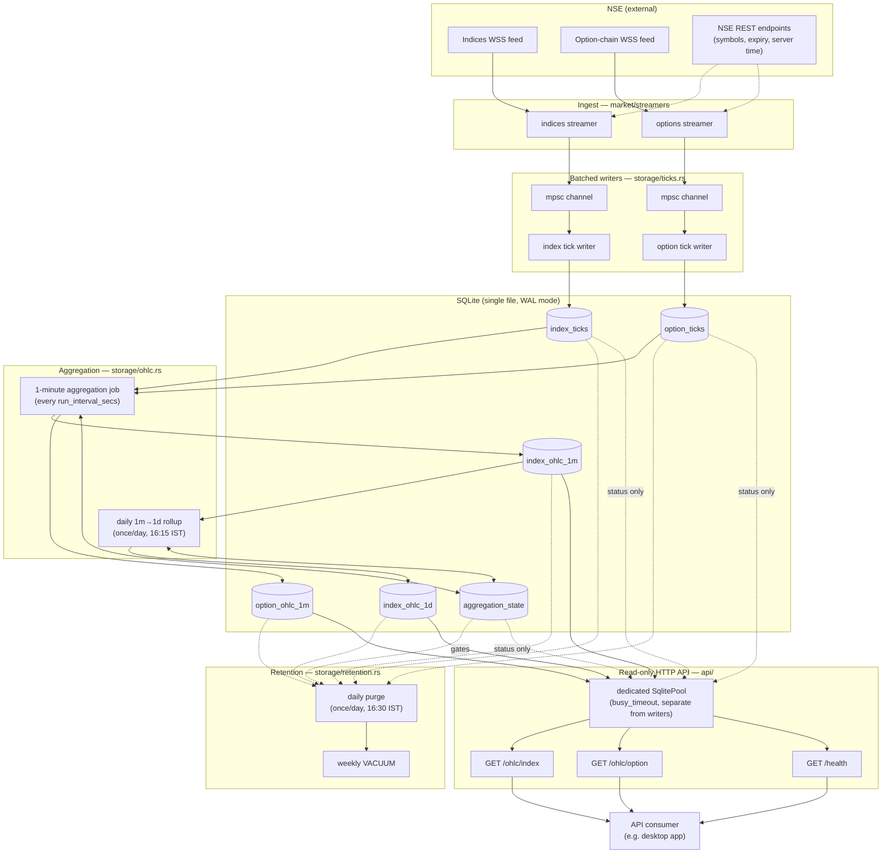

# kstocks-server

Standalone Rust backend that connects to NSE's WebSocket streams for index
and F&O option data, persists raw ticks to SQLite, aggregates them into
OHLC bars, purges old data on a retention schedule, and serves the
aggregated bars over a read-only HTTP API.

## What it does

1. **Ingest** — Connects to NSE's indices and option-chain WSS feeds,
   batches incoming ticks, and writes them to SQLite (`index_ticks` /
   `option_ticks`).
2. **Aggregate** — Rolls raw ticks up into 1-minute OHLC bars every few
   minutes, and 1-minute bars up into daily bars once per day after
   market close.
3. **Retain** — Purges raw ticks and intermediate OHLC tiers once they're
   safely aggregated and outside their retention window; runs a weekly
   `VACUUM`.
4. **Serve** — Exposes the aggregated OHLC bars (never raw ticks, never
   the in-progress candle) over a small read-only HTTP API.

## Architecture

The process is a single binary running several independent background
tasks around one SQLite file, plus an HTTP server. There's no message
queue or external service — everything communicates through the
database (and one in-process `mpsc` channel per tick writer).



Key architectural points:

- **Two SQLite pools, one file.** The ingest writers and the HTTP API use
  separate `SqlitePool`s against the same database file. The API's pool
  sets a `busy_timeout`, so a slow analytical read never blocks — or gets
  blocked by — the high-frequency tick writers under WAL mode.
- **Everything downstream is watermark-driven.** Aggregation only scans
  ticks newer than `aggregation_state.last_bucket_end`; retention only
  purges data that aggregation has already confirmed it processed. There's
  no shared lock or coordinator — each job reads/writes its own watermark
  row and moves forward independently.
- **No live/streaming path through the API.** The API only ever reads
  already-committed OHLC rows. A consumer wanting the in-progress candle
  is expected to connect to NSE's WSS directly and use this API only for
  historical gap-fill.
- **Upserts make every stage idempotent.** Aggregation and rollup both use
  `INSERT ... ON CONFLICT ... DO UPDATE`, so a crashed or restarted job can
  safely re-process a bucket without creating duplicates.

## Project layout

```
src/
  main.rs              entry point: wiring, task spawning, shutdown
  settings.rs           config structs + load/save of settings_server.json
  stats.rs               shared in-memory stats (dashboard + health endpoint)
  market/               everything related to fetching NSE data
    http.rs               shared reqwest client + NSE User-Agent
    market_clock.rs        NSE-clock-derived session mode (Active/Idle)
    symbols.rs             resolves F&O symbols + nearest expiry
    streamers/
      indices.rs            indices WSS streamer
      options.rs             option-chain WSS streamer
  storage/              persistence: ingest, aggregation, retention
    ticks.rs              schema, batched tick writers
    ohlc.rs                1m/1d OHLC aggregation (watermark-driven)
    retention.rs           purge + vacuum routines
  api/                  read-only HTTP API
    mod.rs                 router, shared state, range/interval helpers
    index_ohlc.rs          GET /ohlc/index
    option_ohlc.rs          GET /ohlc/option
    health.rs               GET /health
  utils/
    dashboard.rs           terminal dashboard (ratatui)
```

## Running

```
cargo run -- [--no-dashboard]
```

`--no-dashboard` runs headless (useful under systemd/cron); otherwise an
interactive terminal dashboard shows stream/db/session status until you
quit it (streaming continues in the background either way).

On first run, a default config is written to
`<data-local-dir>/.kstocks/settings_server.json` (falls back to the
current directory if no data-local-dir is available). Edit that file to
change ports, retention windows, aggregation cadence, etc. — see
[Configuration](#configuration) below.

## Configuration

All settings live in `settings_server.json`, created with defaults on
first run. Relevant sections for this feature set:

```jsonc
{
  "aggregation": {
    "run_interval_secs": 300     // how often the 1m OHLC job runs
  },
  "retention": {
    "raw_ticks_keep_trading_days": 2,
    "index_ohlc_1m_keep_days": 60,
    "option_ohlc_1m_expiry_grace_days": 7,
    "index_ohlc_1d_keep_days": 1095   // 3 years; 0 = keep forever
  },
  "api": {
    "port": 8787
  }
}
```

| Field | Default | Meaning |
|---|---|---|
| `aggregation.run_interval_secs` | `300` | How often (seconds) raw ticks are rolled up into `index_ohlc_1m` / `option_ohlc_1m`. The daily `index_ohlc_1m` → `index_ohlc_1d` rollup runs once per day at 16:15 IST, independent of this setting. |
| `retention.raw_ticks_keep_trading_days` | `2` | Raw `index_ticks` / `option_ticks` older than this are purged, gated on confirmed `*_ohlc_1m` coverage. |
| `retention.index_ohlc_1m_keep_days` | `60` | `index_ohlc_1m` rows older than this are purged, gated on confirmed `index_ohlc_1d` coverage. |
| `retention.option_ohlc_1m_expiry_grace_days` | `7` | `option_ohlc_1m` rows are purged once `expiry_date < today - N days`. Hard rule based on contract expiry, not a rolling window. |
| `retention.index_ohlc_1d_keep_days` | `1095` (3 yrs) | `index_ohlc_1d` rows older than this are purged. `0` = keep indefinitely. |
| `api.port` | `8787` | Port the read-only HTTP API listens on (all interfaces). |

The daily purge runs once per day at 16:30 IST (after the daily rollup),
followed by `PRAGMA optimize`. `VACUUM` runs weekly on its own schedule
since it briefly locks the whole database file.

## Data model

### Raw ticks
- `index_ticks` — one row per index tick as received from NSE.
- `option_ticks` — one row per option-chain tick (CE/PE combined, wide
  shape).

### OHLC tiers
- `index_ohlc_1m` — 1-minute index bars: `(index_name, bucket_start)` →
  `open, high, low, close, tick_count`.
- `index_ohlc_1d` — daily index bars, rolled up from `index_ohlc_1m`
  (never from raw ticks). Same shape as `index_ohlc_1m`.
- `option_ohlc_1m` — 1-minute option bars, wide CE/PE shape:
  `(symbol, expiry, strike_price, bucket_start)` →
  `ce_open/high/low/close/volume/oi_close`, `pe_open/high/low/close/volume/oi_close`,
  `tick_count`, plus a comparable `expiry_date` column for cheap retention
  checks. There is no `option_ohlc_1d` — options don't need daily bars.

### Bookkeeping
- `aggregation_state` — one row per aggregated table
  (`index_ohlc_1m` / `option_ohlc_1m` / `index_ohlc_1d`), tracking
  `last_bucket_end` so each aggregation run only scans new data.

### Aggregation guarantees
- **Idempotent**: every insert is an upsert
  (`INSERT ... ON CONFLICT ... DO UPDATE`), so re-running a pass over the
  same range never duplicates rows.
- **No partial bars**: only fully-elapsed 1-minute buckets are ever
  aggregated; the in-progress current minute is always excluded.
- **No gap-filling**: a bucket with zero raw ticks (genuine lull or WSS
  outage — not distinguished) simply has no row. No nulls, no
  fill-forward.

## HTTP API

Read-only. Runs on its own SQLite connection pool (separate from the
ingest writers, same database file) with a `busy_timeout`, so slow reads
never contend with the ingest writer under WAL mode.

The API only ever serves **completed, already-aggregated** bars from the
OHLC tables. It never reads raw ticks and never represents the
in-progress current candle — that's the desktop app's job once it
connects directly to NSE's WSS for gap-fill. There is intentionally no
push/streaming endpoint.

Base URL: `http://<host>:<api.port>` (default port `8787`).

---

### `GET /ohlc/index`

Index OHLC bars, sourced from `index_ohlc_1m` or `index_ohlc_1d`
depending on the requested interval.

**Query parameters**

| Param | Required | Description |
|---|---|---|
| `name` | yes | Index name (as stored in `index_ticks.index_name`) |
| `range` | yes | One of `1d, 3d, 5d, 7d, 14d, 1mo, 3mo, 6mo, 1y` |
| `interval` | yes | Must be valid for the given `range` (table below) |

**Valid `range` → `interval` combinations**

| `range` | Valid `interval` values | Source table |
|---|---|---|
| `1d` | `1m, 3m, 5m, 15m, 30m` | `index_ohlc_1m` |
| `3d` | `15m, 30m, 1h` | `index_ohlc_1m` |
| `5d` | `30m, 1h, 2h` | `index_ohlc_1m` |
| `7d` | `1h, 2h, 4h` | `index_ohlc_1m` |
| `14d` | `2h, 4h` | `index_ohlc_1m` |
| `1mo` | `4h` (from `index_ohlc_1m`), `1d` (from `index_ohlc_1d`) | mixed |
| `3mo` | `1d, 1w` | `index_ohlc_1d` |
| `6mo` | `1d, 1w` | `index_ohlc_1d` |
| `1y` | `1w, 1mo` | `index_ohlc_1d` |

Any other `range`/`interval` combination returns `400 Bad Request`.

Intervals coarser than the source tier's native bucket size (e.g. `2h`
from 1-minute bars) are aggregated on read via a windowed `GROUP BY`.
Buckets with no underlying data are omitted from the response — gaps are
never filled or synthesized.

**Example request**

```
GET /ohlc/index?name=NIFTY%2050&range=1d&interval=5m
```

**Example response**

```json
[
  {
    "bucket_start": "2026-07-20T03:45:00+00:00",
    "open": 24812.35,
    "high": 24830.10,
    "low": 24805.00,
    "close": 24821.75
  },
  {
    "bucket_start": "2026-07-20T03:50:00+00:00",
    "open": 24821.75,
    "high": 24845.60,
    "low": 24818.90,
    "close": 24840.20
  }
]
```

**Error response** (invalid range/interval)

```json
{ "error": "invalid interval '10m' for range '1d'; valid: [\"1m\", \"3m\", \"5m\", \"15m\", \"30m\"]" }
```

---

### `GET /ohlc/option`

Option OHLC bars (wide CE/PE shape), always sourced from
`option_ohlc_1m`.

**Query parameters**

| Param | Required | Description |
|---|---|---|
| `symbol` | yes | F&O symbol (e.g. `NIFTY`) |
| `expiry` | yes | Expiry string as stored on the tick (e.g. `25-Jul-2026`) |
| `strike` | yes | Strike price (numeric) |
| `range` | yes | One of `1d, 3d, 5d, 7d, 14d` |
| `interval` | yes | Must be valid for the given `range` (table below) |
| `leg` | no | `CE`, `PE`, or `both` (default `both`) |

**Valid `range` → `interval` combinations**

| `range` | Valid `interval` values |
|---|---|
| `1d` | `1m, 5m, 15m` |
| `3d` | `15m, 30m, 1h` |
| `5d` | `30m, 1h, 2h` |
| `7d` | `1h, 2h, 4h` |
| `14d` | `2h, 4h` |

Same gap rule as the index endpoint: missing buckets are omitted, never
filled.

**Example request**

```
GET /ohlc/option?symbol=NIFTY&expiry=25-Jul-2026&strike=25000&range=1d&interval=5m&leg=CE
```

**Example response**

```json
[
  {
    "bucket_start": "2026-07-20T03:45:00+00:00",
    "ce_open": 142.30,
    "ce_high": 145.80,
    "ce_low": 141.10,
    "ce_close": 144.95,
    "ce_volume": 18200,
    "ce_oi_close": 512400,
    "pe_open": null,
    "pe_high": null,
    "pe_low": null,
    "pe_close": null,
    "pe_volume": null,
    "pe_oi_close": null
  }
]
```

When `leg=both`, both `ce_*` and `pe_*` fields are populated (each
independently `null` if that leg had no ticks in the bucket). When
`leg=CE` or `leg=PE`, the other leg's fields are always `null` and a
bucket is only included if the requested leg has data.

**Error response** (invalid leg)

```json
{ "error": "invalid leg; must be CE, PE, or both" }
```

---

### `GET /health`

No query parameters. Returns current ingest/aggregation status.

**Example response**

```json
{
  "db_connected": true,
  "last_index_tick_at": "2026-07-20T09:58:12.481Z",
  "last_option_tick_at": "2026-07-20T09:58:10.902Z",
  "aggregation_watermarks": {
    "index_ohlc_1m": "2026-07-20T09:57:00Z",
    "option_ohlc_1m": "2026-07-20T09:57:00Z",
    "index_ohlc_1d": "2026-07-20T00:00:00Z"
  },
  "session_mode": "ACTIVE"
}
```

| Field | Meaning |
|---|---|
| `db_connected` | Whether the API's read pool could reach the database |
| `last_index_tick_at` / `last_option_tick_at` | Timestamp of the most recent raw tick received, per stream |
| `aggregation_watermarks` | `last_bucket_end` per aggregated table — how far each aggregation tier has processed |
| `session_mode` | `ACTIVE` (holding live WSS connections) or `IDLE` (polling), reusing the same market-hours logic as the dashboard |

---

## Notes for API consumers

- All timestamps are RFC 3339 / ISO 8601 in UTC.
- Bars are only ever emitted once fully closed — there is no way to get
  the currently-forming candle from this API by design.
- Because gaps are never filled, don't assume evenly-spaced buckets;
  consumers should key off `bucket_start` rather than array index.
- `strike` is compared as a floating-point value against
  `option_ohlc_1m.strike_price` — pass the exact strike as stored (e.g.
  `25000`, not `25000.0` vs `25000.00` formatting concerns; SQLite
  numeric comparison handles this fine).